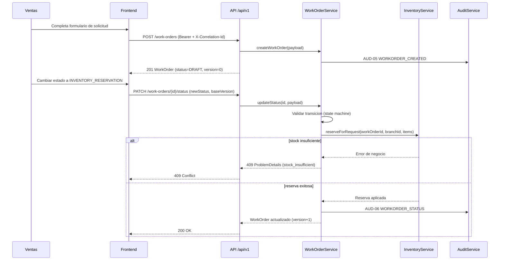
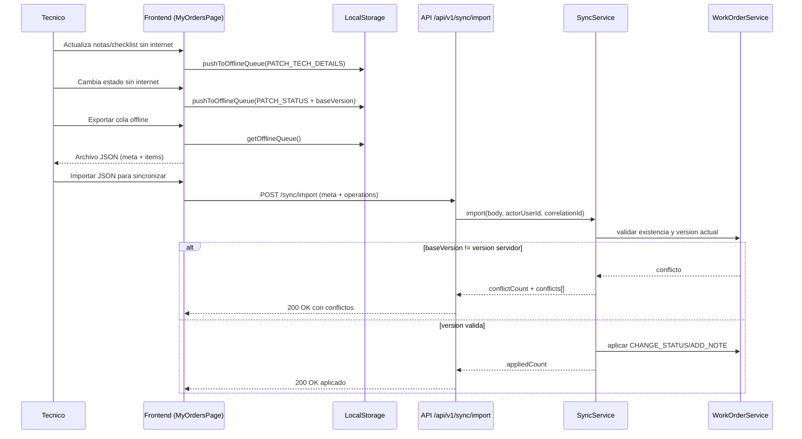

Diagramas de secuencia (minimo 2)

1) Flujo principal: crear solicitud -> reservar inventario -> cambio de estado -> auditoria

2) Flujo tecnico offline: cola local -> export JSON -> import y conflictos por baseVersion

