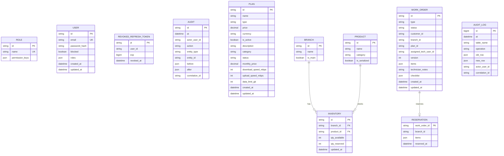

ERD + guia offline (export/import JSON)

Este documento aterriza dos requisitos:
1) diagrama ERD del modelo actual
2) guia offline-first con LocalStorage, export JSON e import con conflictos por baseVersion

---

1. ERD (modelo actual de Prisma)

Fuente: `apps/api/prisma/schema.prisma`



Reglas y constraints relevantes
- `roles.name` unico.
- `users.email` unico.
- `inventory` unico por `(branch_id, product_id)`.
- `reservation.work_order_id` es PK y FK a `work_orders.id`.
- stock negativo no permitido por reglas de servicio (reserva/liberacion atomica).
- concurrencia optimista en work orders con campo `version`.

---

2. Guia offline-first (tecnico)

Fuentes
- UI/cola offline: `apps/web/src/pages/MyOrdersPage.tsx`
- util de cola/export: `apps/web/src/utils/offlineQueue.ts`
- import backend: `apps/api/src/routes/sync.routes.ts`
- logica de conflictos: `apps/api/src/domain/services/sync.service.ts`

2.1 Operaciones soportadas sin internet
- ver ordenes ya cargadas en pantalla
- actualizar `technicianNotes` y `checklist`
- cambiar estado con `baseVersion`
- guardar cambios en cola local
- exportar cola a JSON

2.2 Estructura LocalStorage

Claves definidas en frontend
- `access_token`
- `refresh_token`
- `plans_cache`
- `offline_queue` (helper generico)
- `offlineQueue` (cola usada por `offlineQueue.ts`)

Nota tecnica
- la cola operativa de Mis Ordenes usa `offlineQueue`.

Schema de item en cola (`offlineQueue`)

```json
{
  "id": "uuid",
  "op": "PATCH_TECH_DETAILS | PATCH_STATUS",
  "workOrderId": "wo_123",
  "payload": {},
  "timestamp": "2026-03-01T12:00:00.000Z"
}
```

Payload por operacion
- `PATCH_STATUS`:
```json
{ "newStatus": "VERIFICATION", "baseVersion": 3 }
```
- `PATCH_TECH_DETAILS`:
```json
{
  "technicianNotes": "Texto tecnico",
  "checklist": [
    { "id": "1", "label": "Verificar equipo", "completed": true }
  ]
}
```

2.3 Export JSON (RF-11)

El boton "Exportar cola offline a JSON" genera:

```json
{
  "meta": {
    "deviceId": "userAgent-trimmed",
    "exportedAt": "2026-03-01T12:00:00.000Z",
    "appVersion": "1.0"
  },
  "items": [
    {
      "tipo": "PATCH_STATUS",
      "entidad": "WORK_ORDER",
      "workOrderId": "wo_123",
      "operacion": "PATCH_STATUS",
      "payload": { "newStatus": "VERIFICATION", "baseVersion": 3 },
      "timestamp": "2026-03-01T11:55:00.000Z",
      "id": "uuid-op-1"
    }
  ]
}
```

2.4 Import JSON (RF-12) via API

Endpoint:
- `POST /api/v1/sync/import`

Auth:
- Bearer token + permiso `sync:import`

Body esperado por API:

```json
{
  "meta": {
    "exportedAt": "2026-03-01T12:00:00.000Z",
    "deviceId": "device-001",
    "appVersion": "1.0"
  },
  "operations": [
    {
      "opId": "uuid-op-1",
      "entityType": "workOrder",
      "entityId": "wo_123",
      "operation": "CHANGE_STATUS",
      "payload": { "newStatus": "VERIFICATION", "baseVersion": 3 },
      "createdAt": "2026-03-01T11:55:00.000Z",
      "createdBy": "usr-tecnico-01",
      "baseVersion": 3,
      "correlationId": "c_manual_001"
    }
  ]
}
```

Mapeo de operaciones (export -> import)
- `PATCH_STATUS` -> `CHANGE_STATUS`
- `PATCH_TECH_DETAILS` -> `ADD_NOTE`

2.5 Conflictos por version (baseVersion)

Regla de negocio:
- si `baseVersion` de la operacion no coincide con `workOrder.version` actual en servidor, la operacion no se aplica.

Respuesta:
- HTTP `200` con conteo de aplicadas y conflictos.

Ejemplo:

```json
{
  "appliedCount": 0,
  "conflictCount": 1,
  "conflicts": [
    {
      "opId": "uuid-op-1",
      "entityId": "wo_123",
      "reason": "Version mismatch"
    }
  ]
}
```

2.6 Manejo esperado de errores
- `400`: schema invalido
- `401`: token ausente/invalido
- `403`: sin permiso `sync:import`
- `200`: import procesado (con o sin conflictos)

---

3. Checklist de demo offline

1. Login como tecnico.
2. Abrir Mis Ordenes y desconectar red.
3. Cambiar estado y guardar notas/checklist.
4. Verificar operaciones en LocalStorage (`offlineQueue`).
5. Exportar JSON.
6. Reconectar red y sincronizar (flush automatico) o importar por API `/sync/import`.
7. Verificar conflictos por `baseVersion` cuando aplique.
